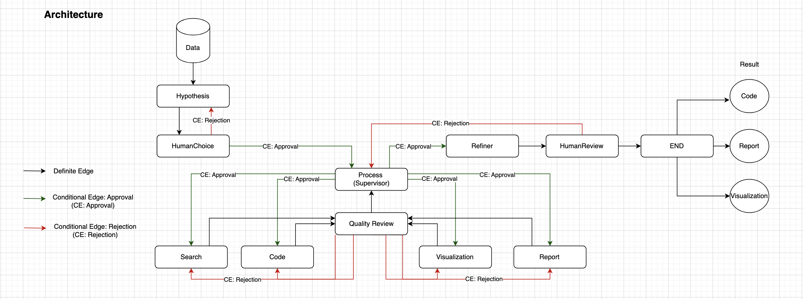

### Research and Data Analysis Platform Using Multi-Agent Systems

- Developed an AI-driven research and data analysis platform that leverages multiple agents to automate tasks like data analysis, visualization, ML model building and report generation. This system is built using LangGraph, LangChain, and OpenAI's GPT models, enabling seamless workflow execution and enhanced research efficiency.
- The Method include an hypothesis engine for AI-driven hypothesis generation, validation, and refinement. It involves data processing for robust data cleaning and quality assurance, and a visualization suite for interactive visualizations, ML model creation for prediction, custom reports, and automated insights.
- Main component involves: 
  - hypothesis_agent → Generates research hypotheses.
  - process_agent → Oversees the research workflow.
  - visualization_agent → Creates interactive visualizations.
  - code_agent → Writes data analysis, visualization, model building scripts.
  - searcher_agent → Conducts literature reviews and web searches.
  - report_agent → Writes research reports.
  - quality_review_agent → Ensures data and report quality.
  - refiner_agent → Enhances and refines reports and visualization generated.
  - human_choice_node → Allows users to regenerate hypotheses if needed.
  - human_review_node → Incorporates user feedback into the workflow.
- Workflow: 
  - Hypothesis Generation → AI formulates research hypotheses.
  - Human Choice → User decides whether to proceed or regenerate the hypothesis.
  - Processing → Data analysis, visualization, model building, and report generation.
  - Quality Review → Ensures accuracy and consistency in generated data.
  - Refinement → Refines the research report and visualization.
- Architecture flow is shown below
